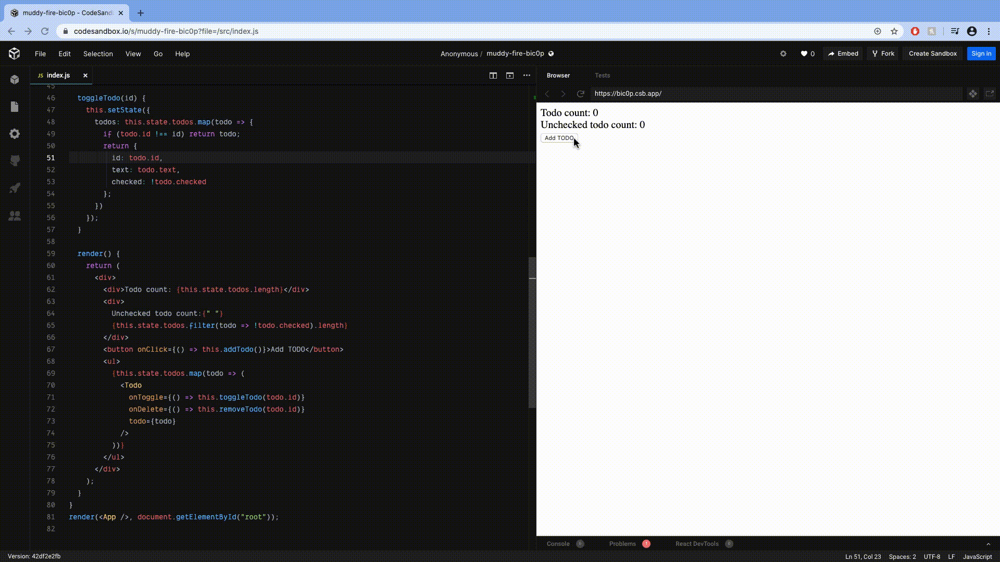

# Todo App in React
### The Demonstration below is from "todoApp4-react.js" file

"todoApp0.js", "todoApp1.js", "todoApp2.js", and "todoApp3.js" are just rouch sudo examples used to describe the difference between Javascript(imperative) and React(declarative).

